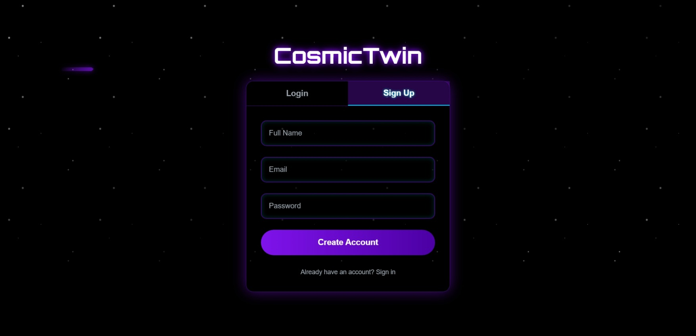

# 🌌 CosmicTwin

**CosmicTwin** is an innovative personality-driven social platform that matches users with their perfect planetary home and connects them with like-minded cosmic souls. Through AI-powered personality analysis and vector-based matching, discover your celestial identity and build meaningful connections across the galaxy.

Users take a quiz, get matched to their **home planet**, and discover their **cosmic twinmates** through vector similarity search.  
The platform combines **Qdrant**, **Mistral AI**, and **React Three Fiber** to create a playful yet technically powerful experience.

---
🌟 **[🚀 Try CosmicTwin Live](https://cosmic-twin-vr.vercel.app/)** 🌟

## 🚀 Key Features

### 🪐 Cosmic Quiz & Planet Match
- Users answer 10 fun, cosmic-themed questions.
- Answers are embedded into a **vector representation** using **Mistral AI**.
- Stored in **Qdrant**, and matched to the closest planet vector.
- Result: Your **home planet** (Xylos, Zylos, or Nilos) + unique traits.

### 💬 Community Hub
- **Global Chat** → Talk with everyone across the cosmos.
- **Local Chat (per planet)** → Talk only with your matched friends.
- **Posts** → Users can share text & images with their community.
- **Poll of the Day** → AI-generated cosmic polls, refreshed every 1 hour (via Mistral AI).
- **Cosmic Prompt** → Fun reflection prompts, refreshed every 6 hours (via MistralAI).
- **Find Twinmates** → Discover your top 5 closest users (via Qdrant similarity search).

### 🌌 Galaxy Map (`/galaxy`)
- Built with **React Three Fiber**.
- Interactive 3D galaxy with rotating planets & glowing textures.
- Each matched user appears as a **glowing orbiting dot** around their planet.
- Matching is done using vector similarity search (Qdrant + embeddings).
- Orbit distance varies based on **similarity score**:
  - The closer the similarity, the closer the dot appears to the planet.  
  -The weaker the similarity, the further the dot orbits away.
  -Example:
   -Score 0.95 → User very close to the planet.
   -Score 0.60 → User a bit farther away
- Hover planet → Shows planet traits & community size.
- Hover user dot → Shows name, planet, type, and similarity score.
- Drag to orbit • Scroll to zoom • Hover for details.

### ✨ Dashboard Extras
- **Message from the Stars** → Mystical AI message refreshed daily.

---

## 🛠️ Tech Stack

- **Frontend**: Next.js + Tailwind + React Three Fiber
- **Backend**: Next.js API Routes
- **Database**: MongoDB
- **Vector Search**: Qdrant (Vector Database)
- **AI Generation**: Mistral AI (quiz embeddings, fortunes, polls, prompts)
- **3D Graphics**: React Three Fiber + Drei

## 📸 Screenshots

### 🏠 Landing Page & Quiz Experience

*Beautiful cosmic-themed homepage that welcomes users to their journey*




*Interactive 10-question cosmic personality assessment*

### 🪐 Planet Match & Galaxy View

*Discover your cosmic twin planet with personalized traits*


*Interactive 3D galaxy built with React Three Fiber showing users and planetss*

### 💬 Community Features

*Global & local chat with your planetary community*

---


## ⚡ Quick Installation

### Prerequisites
- Node.js 18+ installed
- Git installed
```git clone https://github.com/Rrahullkumar/Cosmic-Twin
    cd cosmic-twin
    npm install```

- Add your own API keys to `.env.local` (MongoDB URI, Qdrant credentials, Mistral API key)
    **Run the development server**
    ```npm run dev```


## 🌟 Why CosmicTwin?

- Turns social networking into a **gamified cosmic adventure**.  
- **Embeddings + Qdrant** make community truly personalized.  
- Visualizes community in a **galaxy map** — a feature that wows both technically and aesthetically.  

---

## 📌 Future Enhancements
- Local planet-only chats.  
- More planets & traits.   
- Mobile app version.  

---

## 🔗 Links
- **🌟 [Live Application](https://cosmic-twin-vr.vercel.app/)**
- ** [GitHub Repository](https://github.com/Rrahullkumar/Cosmic-Twin)**


🌠 *CosmicTwin makes the universe your community.* 🚀
